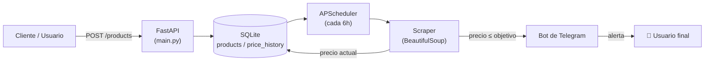

<div align="center">

# 🔔 Price Alert Bot

**Sistema automatizado de monitorización de precios con notificaciones en tiempo real vía Telegram**


</div>

---

## 📌 ¿Qué problema resuelve?

Comprar al mejor precio significa estar pendiente de una página constantemente, algo que nadie quiere hacer a mano. **Price Alert Bot** automatiza ese trabajo: vigila los productos que le indiques, registra su histórico de precios y te avisa por Telegram **en el momento exacto** en que el precio cae por debajo de tu objetivo.

Construido como ejercicio de diseño de un servicio backend completo y desacoplado: **API → persistencia → tareas en segundo plano → scraping → notificación**, cada pieza con una responsabilidad clara.

---

## 🏗️ Arquitectura



**Flujo:** el usuario registra un producto vía API → el scheduler revisa el precio periódicamente → si baja del objetivo, se dispara una notificación de Telegram con el enlace de compra.

---

## ✨ Features

- 📦 **API REST** (FastAPI) para crear, listar y eliminar productos a vigilar
- ⏱️ **Tareas en segundo plano** con APScheduler — revisión automática cada 6 horas, sin intervención manual
- 🕷️ **Web scraping resiliente**: rotación de user-agents, múltiples selectores de respaldo y delays aleatorios para evitar bloqueos
- 📈 **Histórico de precios** persistido en SQLite para analizar tendencias
- 📲 **Notificaciones push por Telegram** con producto, precio y enlace directo
- 🧩 **Arquitectura desacoplada**: API, scraping, scheduling y notificaciones en módulos independientes y testeables

---

## 🧱 Stack técnico

| Capa                  | Tecnología                          | ¿Por qué? |
|-----------------------|--------------------------------------|-----------|
| API                   | FastAPI + Uvicorn                   | Tipado con Pydantic, async-first, docs automáticas (`/docs`) |
| Persistencia          | SQLAlchemy + SQLite                 | ORM ligero, fácil de migrar a Postgres en producción |
| Tareas programadas    | APScheduler                         | Jobs en background sin depender de un cron externo |
| Scraping              | requests + BeautifulSoup4           | Extracción de precio tolerante a cambios de HTML |
| Notificaciones        | python-telegram-bot                 | API oficial de Telegram, mensajes con Markdown |
| Validación de datos   | Pydantic                            | Esquemas de entrada/salida seguros en la API |

---

## 📁 Estructura del proyecto

```
price-alert-bot/
├── main.py          # API FastAPI: endpoints de productos
├── models.py        # Modelos SQLAlchemy (Product, PriceHistory)
├── database.py      # Configuración de la conexión a SQLite
├── scraper.py       # Extracción del precio desde la URL del producto
├── scheduler.py     # Job periódico que revisa precios y dispara alertas
├── bot.py           # Envío de mensajes por Telegram
├── requirements.txt
└── .gitignore
```

---

## ⚙️ Instalación y uso

### 1. Clonar y crear entorno virtual

```bash
git clone <url-del-repo>
cd price-alert-bot
python -m venv .venv
source .venv/bin/activate      # Windows: .venv\Scripts\activate
```

### 2. Instalar dependencias

```bash
pip install fastapi uvicorn sqlalchemy pydantic apscheduler requests beautifulsoup4 python-telegram-bot python-dotenv
```

### 3. Configurar variables de entorno

Crea un archivo `.env` en la raíz:

```env
TELEGRAM_TOKEN=tu_token_de_telegram
```

> 🔒 El token del bot se carga desde variables de entorno — nunca se versiona en el código. Si quieres tu propio bot, créalo en segundos hablando con [@BotFather](https://t.me/BotFather).

### 4. Ejecutar

```bash
uvicorn main:app --reload
```

API disponible en `http://localhost:8000` — documentación interactiva automática en `http://localhost:8000/docs`.

---

## 📡 Endpoints de la API

### Añadir producto a vigilar

```http
POST /products
```

```json
{
  "url": "https://www.amazon.es/dp/EJEMPLO",
  "name": "Auriculares XYZ",
  "target_price": 49.99,
  "chat_id": "123456789"
}
```

### Listar productos vigilados

```http
GET /products
```

### Eliminar un producto

```http
DELETE /products/{product_id}
```

---

## 🔄 Cómo funciona internamente

1. El usuario registra un producto con su URL, nombre, precio objetivo y `chat_id` de Telegram.
2. Cada 6 horas, `scheduler.py` recorre todos los productos registrados.
3. `scraper.py` visita cada URL y extrae el precio actual probando varios selectores HTML como fallback (resistente a pequeños cambios de maquetación).
4. El precio se guarda en `price_history` para mantener un histórico consultable.
5. Si el precio ≤ precio objetivo, `bot.py` envía una alerta formateada por Telegram con el enlace de compra.

---

## 🧠 Decisiones de diseño y aprendizajes

- **Separación de responsabilidades**: scraping, persistencia, scheduling y notificaciones viven en módulos independientes, lo que facilita testear o sustituir cada pieza (por ejemplo, cambiar Telegram por email sin tocar el resto).
- **Resiliencia ante bloqueos**: rotación de user-agents y delays aleatorios para reducir el riesgo de ser bloqueado al hacer scraping.
- **Histórico desacoplado del estado actual**: guardar cada lectura en `price_history` en vez de sobreescribir un único campo permite analizar tendencias de precio a futuro.

---

## 🗺️ Roadmap

- [ ] Editar productos existentes vía API (`PUT /products/{id}`)
- [ ] Soporte multi-tienda (más allá de Amazon)
- [ ] Migración a PostgreSQL para despliegue en producción
- [ ] Autenticación en la API (API key / OAuth)
- [ ] Tests unitarios e integración (pytest)
- [ ] Dockerfile + docker-compose para despliegue en un solo comando
- [ ] Dashboard web para visualizar el histórico de precios

---

## 📄 Licencia

MIT — libre para usar, modificar y distribuir.

---

<div align="center">

Hecho con 🐍 Python · ¿Dudas o feedback? Abre un issue o conecta conmigo en [LinkedIn](#) · [Portfolio](#)

</div>
